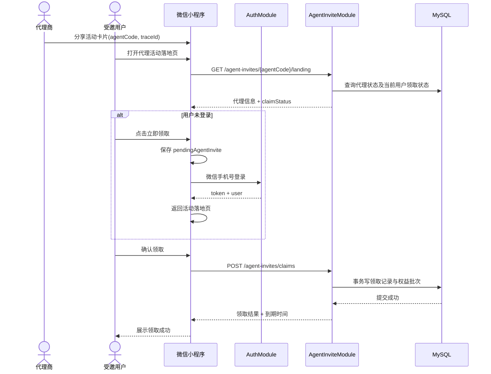
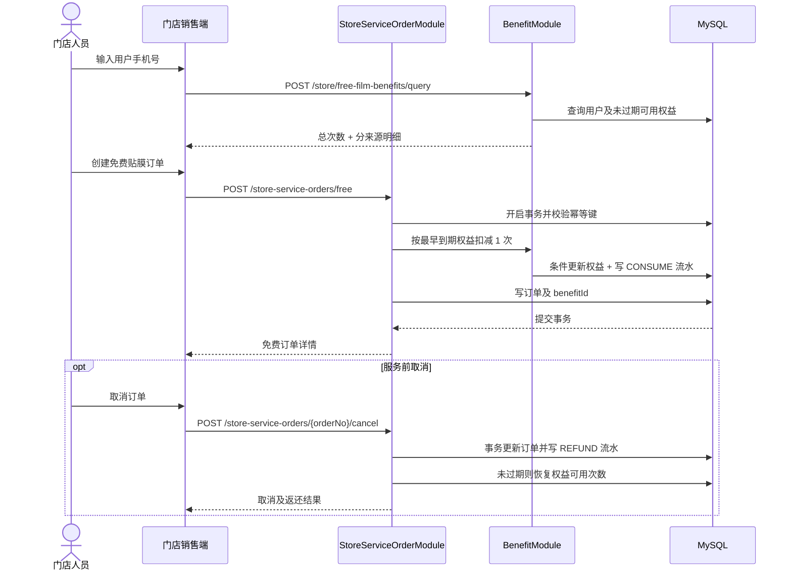

# 代理商邀请赠送免费贴膜功能技术设计

> 文档状态：待开发  
> 适用版本：V1  
> 小程序：uni-app + Vue 3 + TypeScript + Pinia  
> 管理后台：Vue 3 + TypeScript + Element Plus  
> 服务端：NestJS + Prisma + MySQL  
> 接口风格：REST，统一响应 `{ code, message, data }`

## 1. 背景与目标

当前小程序已有微信手机号登录、邀请码分享、用户上下级关系、VIP 免费贴膜次数、门店查询会员及免费贴膜订单等能力。本功能在不破坏现有推荐关系和会员体系的前提下，增加“代理商分享获客”能力：代理商分享活动给用户，用户注册或登录后可领取一次免费贴膜。

本期目标：

- 后台可以为现有用户人工开通、停用和恢复代理资格。
- 代理商可以分享专属活动链接，并查看合理范围内的邀请结果。
- 新老用户均可通过活动落地页领取 1 次免费贴膜。
- 每个用户全平台最多成功领取一次，权益自领取起 30 天有效。
- 代理赠送权益与 VIP 权益分账管理，但门店可通过统一入口查询和核销。
- 领取、扣减、返还全程可审计，并能抵抗重复请求和并发超扣。

本期不包含代理申请、付费开通、代理等级、佣金结算、营销活动配置、批量导入。

## 2. 现状与设计原则

### 2.1 当前项目现状

- `UserItem.role` 是单值，现有值包括 `USER`、`VIP`、三级店长和 `PLATFORM`。
- 登录接口为 `POST /auth/wx-phone-login`，登录页已支持解析 `inviterCode`。
- `inviterCode`、`inviter2Code` 已用于推荐上下级关系。
- 免费贴膜目前通过 `vipGift` 和 `/store/checkMember` 暴露，语义绑定 VIP。
- 免费订单入口为 `/store-service-order/freeAdd`，取消及完成已有独立接口。

### 2.2 核心原则

1. **代理资格不占用 `role`**：代理是可叠加资格，使用独立 `AgentProfile`；VIP、店长均可同时成为代理。
2. **推荐关系与代理归因隔离**：`inviterCode` 继续维护原推荐/佣金链；代理链接只传 `agentCode`，不得覆盖用户原邀请人。
3. **权益分账、查询统一**：代理赠送和 VIP 月度次数分别入账，统一查询可用余额，核销时记录具体来源。
4. **服务端裁决**：领取资格、有效期、扣减顺序均由服务端判断，客户端展示不能作为业务依据。
5. **强幂等和可审计**：唯一约束是最终防线；领取、消费和返还均产生流水。

## 3. 业务规则

| 规则 | V1 定义 |
| --- | --- |
| 代理开通 | 后台管理员为已有用户人工开通 |
| 身份叠加 | 代理资格可与普通用户、VIP、店长叠加 |
| 分享标识 | `agentCode` 标识代理，`traceId` 标识一次分享链路 |
| 领取动作 | 用户必须在落地页主动点击“立即领取” |
| 新用户 | 微信手机号注册登录后返回落地页领取 |
| 老用户 | 使用现有登录态或登录后领取 |
| 原邀请关系 | 不新增、不覆盖 `inviterCode` 和 `inviter2Code` |
| 领取上限 | 每个用户全平台最多成功领取一次代理赠送 |
| 赠送内容 | 免费贴膜 1 次 |
| 有效期 | 服务端领取成功时间起 30 天 |
| 自邀 | 代理本人不能领取自己的邀请 |
| 停用代理 | 禁止产生新领取；已发放权益不撤销 |
| 核销顺序 | 在全部可用权益中按 `expiresAt ASC`，再按 `createdAt ASC` |
| 订单取消 | 未完成订单可原路返还；返还时已过期则保持不可用 |
| 服务完成 | 已完成服务不可取消、不可返还 |

“全平台最多一次”以 `AgentInviteClaim.inviteeUserId` 的数据库唯一约束为准。用户通过不同代理链接、不同设备或并发请求均不能重复获得权益。

## 4. 端到端流程

### 4.1 分享、登录与领取



### 4.2 门店查询、核销与取消返还



## 5. 小程序设计

### 5.1 页面与模块改造

| 类型 | 建议位置 | 说明 |
| --- | --- | --- |
| 新页面 | `src/pages/agentInvite/landing.vue` | 代理邀请活动落地页 |
| 新 API | `src/api/agentInvite.ts` | 落地信息、领取、领取结果 |
| 新 API | `src/api/benefit.ts` | 用户免费权益查询 |
| 新类型 | `src/types/AgentInvite.d.ts` | 代理、邀请和领取状态类型 |
| 新类型 | `src/types/Benefit.d.ts` | 免费权益汇总和明细类型 |
| 调整 | `src/pages.json` | 注册代理邀请落地页 |
| 调整 | `src/pages/login/login.vue` | 保存并恢复邀请上下文 |
| 调整 | `src/types/UserItem.d.ts` | 增加可选 `agentProfile`，不修改 `role` |
| 调整 | `src/pagesMember/myFriends/myFriends.vue` | 代理使用独立代理分享入口，普通推荐分享保持原逻辑 |
| 调整 | `src/pagesMember/sellPage/useQueryMember.ts` | 从 VIP 查询迁移为统一免费权益查询 |

建议落地页路由：

```text
/pages/agentInvite/landing?agentCode=AGT8K2M9&traceId=0194b7c5-...
```

参数约束：

- `agentCode`：服务端生成的 8～16 位大写字母数字组合；前端仅允许 `[A-Z0-9]{8,16}`。
- `traceId`：客户端每次分享前生成 UUID，用于归因统计，不参与领取唯一性判断。
- 参数不合法时不请求领取接口，展示“分享链接无效”。
- 不允许将手机号、用户 ID、token 放入分享路径。

### 5.2 落地页状态

| 状态 | 主文案 | 主按钮行为 |
| --- | --- | --- |
| `LOGIN_REQUIRED` | 登录后领取免费贴膜 1 次 | 保存上下文并去登录 |
| `CLAIMABLE` | 可领取，领取后 30 天有效 | 二次确认后调用领取接口 |
| `CLAIMED_UNUSED` | 已领取，剩余 1 次 | 跳转附近门店/首页 |
| `CLAIMED_USED` | 本次赠送已使用 | 查看相关订单 |
| `CLAIMED_EXPIRED` | 本次赠送已过期 | 返回首页 |
| `SELF_INVITE` | 不能领取自己分享的福利 | 返回首页 |
| `AGENT_UNAVAILABLE` | 活动暂不可用 | 返回首页 |

页面加载时以落地信息接口返回的 `claimStatus` 驱动展示。领取按钮需设置请求中状态，防止用户连续点击；但真正幂等仍由后端保证。

### 5.3 登录上下文恢复

使用单独的本地缓存键保存待处理邀请，不把代理参数混入推荐邀请码：

```ts
export interface PendingAgentInvite {
  agentCode: string
  traceId: string
  createdAt: number
}

const PENDING_KEY = 'pending-agent-invite'
const PENDING_TTL = 30 * 60 * 1000

export function savePendingAgentInvite(value: PendingAgentInvite) {
  uni.setStorageSync(PENDING_KEY, value)
}

export function consumePendingAgentInvite(): PendingAgentInvite | null {
  const value = uni.getStorageSync(PENDING_KEY) as PendingAgentInvite | undefined
  uni.removeStorageSync(PENDING_KEY)
  if (!value || Date.now() - value.createdAt > PENDING_TTL) return null
  return value
}
```

登录流程调整：

1. 未登录用户点击领取时保存 `PendingAgentInvite`，导航到 `/pages/login/login?source=agentInvite`。
2. 登录成功后读取且删除缓存；校验未超 30 分钟后 `redirectTo` 回落地页。
3. 登录取消、授权失败或网络失败时保留缓存，用户可返回落地页重试。
4. 普通登录不读取代理上下文，不影响原有 `inviterCode` 注册逻辑。
5. 登录成功不自动领取，仍需用户在落地页确认。

### 5.4 TypeScript 类型与 API

```ts
export type AgentClaimStatus =
  | 'LOGIN_REQUIRED'
  | 'CLAIMABLE'
  | 'CLAIMED_UNUSED'
  | 'CLAIMED_USED'
  | 'CLAIMED_EXPIRED'
  | 'SELF_INVITE'
  | 'AGENT_UNAVAILABLE'

export interface AgentProfileSummary {
  agentCode: string
  displayName: string
  avatarUrl?: string
  status: 'ACTIVE' | 'DISABLED'
}

export interface AgentInviteLandingResult {
  agent: AgentProfileSummary | null
  claimStatus: AgentClaimStatus
  rewardCount: 1
  validityDays: 30
  claim?: {
    claimedAt: string
    expiresAt: string
    benefitStatus: 'AVAILABLE' | 'USED' | 'EXPIRED'
  }
}

export interface ClaimAgentInviteResult {
  claimId: string
  result: 'GRANTED' | 'ALREADY_CLAIMED'
  benefitId: string
  grantedCount: number
  availableCount: number
  expiresAt: string
}

export type BenefitSourceType = 'AGENT_INVITE' | 'VIP_MONTHLY'

export interface FreeFilmBenefitSummary {
  totalAvailable: number
  nextExpiringAt: string | null
  items: Array<{
    benefitId: string
    sourceType: BenefitSourceType
    availableCount: number
    expiresAt: string
  }>
}
```

```ts
export const getAgentInviteLandingApi = (agentCode: string, traceId?: string) =>
  request<AgentInviteLandingResult>({
    method: 'GET',
    url: `/agent-invites/${encodeURIComponent(agentCode)}/landing`,
    data: traceId ? { traceId } : undefined,
  })

export const claimAgentInviteApi = (agentCode: string, traceId: string) =>
  request<ClaimAgentInviteResult>({
    method: 'POST',
    url: '/agent-invites/claims',
    data: { agentCode, traceId },
  })

export const getMyFreeFilmBenefitsApi = () =>
  request<FreeFilmBenefitSummary>({
    method: 'GET',
    url: '/users/me/free-film-benefits',
  })
```

### 5.5 分享实现要点

代理分享入口必须以服务端返回的 `agentProfile.status === 'ACTIVE'` 为准：

```ts
onShareAppMessage(() => {
  const traceId = createUuid()
  return {
    title: '免费领取一次 AI 手机贴膜',
    path: `/pages/agentInvite/landing?agentCode=${agentCode.value}&traceId=${traceId}`,
    imageUrl: shareImageUrl.value,
  }
})
```

现有“我的推荐”仍分享：

```text
/pages/login/login?inviterCode={referralCode}
```

两类分享入口、参数和统计必须保持独立。

### 5.6 门店端统一权益查询

现有 `checkVipApi` 和 `memberFreeCount` 需逐步迁移为：

- `queryFreeFilmBenefitsByMobileApi(mobile)`：不再要求用户是 VIP。
- `freeBenefitSummary.totalAvailable`：决定订单是否免费。
- 页面提示改为“用户共有 N 次免费贴膜机会”，并可展示最近到期时间。
- 创建免费订单时只提交手机号及订单商品，不提交 `benefitId`；由服务端按规则选择权益，避免客户端篡改。

过渡期可保留旧接口，但旧接口内部应复用统一权益服务，待所有客户端升级后下线。

## 6. 管理后台设计

### 6.1 路由与权限

```ts
export const agentRoutes = {
  path: '/agents',
  meta: { title: '代理商管理', permission: 'agent:view' },
  children: [
    { path: '', component: () => import('@/views/agent/AgentList.vue') },
    { path: ':id', component: () => import('@/views/agent/AgentDetail.vue') },
    { path: 'claims', component: () => import('@/views/agent/AgentClaimList.vue') },
    { path: 'benefits', component: () => import('@/views/benefit/BenefitLedger.vue') },
  ],
}
```

权限点：

| 权限 | 用途 |
| --- | --- |
| `agent:view` | 查看代理列表和详情 |
| `agent:create` | 开通代理资格 |
| `agent:update-status` | 停用或恢复代理 |
| `agent:claim:view` | 查看邀请领取记录 |
| `benefit:view` | 查看权益和核销流水 |

服务端 Guard 必须再次校验权限，前端隐藏按钮不能代替鉴权。V1 不提供人工增减免费次数，避免形成无审计的权益修改入口。

### 6.2 代理商列表

筛选项：代理编号、用户手机号、昵称、状态、开通时间范围。表格字段：代理编号、用户、手机号、叠加身份、状态、成功邀请数、已核销数、开通时间、开通人、操作。

操作规则：

- “开通代理”通过手机号搜索已有用户，确认后提交；同一用户不可重复开通。
- 停用弹窗必须填写 5～200 字原因，并提示“停用后不可产生新领取，已发权益不撤销”。
- 恢复需二次确认；保留原 `agentCode`，历史分享链接重新可用。
- 不提供删除代理，使用状态和审计字段保留历史。

### 6.3 代理详情

展示基础用户信息、代理编号、状态、开通/停用记录，以及以下统计：

- 分享链路数（有 `traceId` 的访问量，可选统计项）
- 成功领取人数
- 未使用、已使用、已过期权益数
- 领取到核销转化率

邀请记录表字段：受邀用户（脱敏）、领取时间、权益到期时间、权益状态、核销门店、核销订单号。后台不得展示微信 `openid`、token 等敏感凭证。

### 6.4 权益及核销流水

筛选项：用户手机号、来源类型、权益状态、代理编号、订单号、流水类型、时间范围。权益表展示发放数、已用数、可用数、有效期和来源。流水表展示 `GRANT`、`CONSUME`、`REFUND`、`EXPIRE` 及关联订单。

### 6.5 管理后台类型

```ts
export interface PageQuery {
  page: number
  pageSize: number
}

export interface PageResult<T> {
  list: T[]
  total: number
  page: number
  pageSize: number
}

export interface CreateAgentDto {
  userId: string
  remark?: string
}

export interface UpdateAgentStatusDto {
  status: 'ACTIVE' | 'DISABLED'
  reason: string
}
```

分页约束为 `page >= 1`、`1 <= pageSize <= 100`；所有筛选参数去除首尾空格，手机号必须符合项目现有校验规则。

## 7. 后端设计

### 7.1 NestJS 模块划分

| 模块 | 职责 |
| --- | --- |
| `AgentModule` | 代理开通、状态管理、详情、后台列表 |
| `AgentInviteModule` | 落地信息、领取资格、领取记录和归因 |
| `BenefitModule` | 权益发放、统一查询、扣减、返还、过期处理 |
| `AuthModule` 扩展 | 登录返回代理摘要，不处理自动领取 |
| `StoreServiceOrderModule` 扩展 | 在免费订单事务中调用权益扣减/返还 |

每个模块包含 Controller、Service、DTO；Prisma 访问集中在 Service 或项目已有 Repository 层，Controller 不直接访问数据库。

### 7.2 Controller 与 Service 职责

- `AgentController`：后台分页、详情、开通和状态变更；使用管理员 JWT Guard 和 Permission Guard。
- `AgentInviteController`：公开落地信息和登录后领取；公开接口只返回安全展示字段。
- `BenefitController`：用户本人权益查询、门店按手机号查询和后台流水查询。
- `AgentService`：生成唯一代理编号、维护状态、写操作审计。
- `AgentInviteService`：校验代理、自邀和全局领取资格，在事务中发放权益。
- `BenefitService`：计算可用权益、按到期时间扣减、返还和生成流水。
- `StoreServiceOrderService`：拥有订单事务边界，保证订单与权益扣减一致。

DTO 使用 `class-validator`，启用全局 `ValidationPipe({ whitelist: true, transform: true })`，拒绝未声明字段。

## 8. 数据库设计

### 8.1 Prisma Schema

以下模型中的 `User`、`StoreServiceOrder` 代表现有模型，只展示需要新增的关系字段；实际迁移时按现有主键类型和表名对齐。

```prisma
enum AgentStatus {
  ACTIVE
  DISABLED
}

enum AgentClaimStatus {
  GRANTED
  REJECTED
}

enum BenefitSourceType {
  AGENT_INVITE
  VIP_MONTHLY
}

enum BenefitStatus {
  AVAILABLE
  EXHAUSTED
  EXPIRED
  DISABLED
}

enum BenefitTransactionType {
  GRANT
  CONSUME
  REFUND
  EXPIRE
}

model AgentProfile {
  id              String             @id @default(cuid())
  userId          String             @unique @map("user_id")
  agentCode       String             @unique @db.VarChar(16) @map("agent_code")
  status          AgentStatus        @default(ACTIVE)
  openedBy        String             @map("opened_by")
  openedAt        DateTime           @default(now()) @map("opened_at")
  disabledBy      String?            @map("disabled_by")
  disabledAt      DateTime?          @map("disabled_at")
  disabledReason  String?            @db.VarChar(200) @map("disabled_reason")
  remark          String?            @db.VarChar(200)
  createdAt       DateTime           @default(now()) @map("created_at")
  updatedAt       DateTime           @updatedAt @map("updated_at")
  deletedAt       DateTime?          @map("deleted_at")

  user            User               @relation(fields: [userId], references: [id])
  claims          AgentInviteClaim[]

  @@index([status, createdAt])
  @@map("agent_profiles")
}

model AgentInviteClaim {
  id              String             @id @default(cuid())
  agentId         String             @map("agent_id")
  inviteeUserId   String             @unique @map("invitee_user_id")
  traceId         String?            @db.VarChar(64) @map("trace_id")
  status          AgentClaimStatus   @default(GRANTED)
  rejectReason    String?            @db.VarChar(100) @map("reject_reason")
  claimedAt       DateTime           @default(now()) @map("claimed_at")
  createdAt       DateTime           @default(now()) @map("created_at")

  agent           AgentProfile       @relation(fields: [agentId], references: [id])
  invitee         User               @relation("AgentInvitee", fields: [inviteeUserId], references: [id])
  benefit         FreeFilmBenefit?

  @@index([agentId, claimedAt])
  @@index([traceId])
  @@map("agent_invite_claims")
}

model FreeFilmBenefit {
  id              String             @id @default(cuid())
  userId          String             @map("user_id")
  sourceType      BenefitSourceType  @map("source_type")
  sourceId        String             @map("source_id")
  claimId         String?            @unique @map("claim_id")
  grantedCount    Int                @map("granted_count")
  usedCount       Int                @default(0) @map("used_count")
  status          BenefitStatus      @default(AVAILABLE)
  effectiveAt     DateTime           @default(now()) @map("effective_at")
  expiresAt       DateTime           @map("expires_at")
  createdAt       DateTime           @default(now()) @map("created_at")
  updatedAt       DateTime           @updatedAt @map("updated_at")

  user            User               @relation(fields: [userId], references: [id])
  claim           AgentInviteClaim?  @relation(fields: [claimId], references: [id])
  transactions    BenefitTransaction[]
  serviceOrders   StoreServiceOrder[]

  @@unique([sourceType, sourceId, userId])
  @@index([userId, status, expiresAt])
  @@map("free_film_benefits")
}

model BenefitTransaction {
  id              String                   @id @default(cuid())
  benefitId       String                   @map("benefit_id")
  userId          String                   @map("user_id")
  type            BenefitTransactionType
  quantity        Int
  orderId         String?                  @map("order_id")
  idempotencyKey  String                   @unique @db.VarChar(80) @map("idempotency_key")
  operatorId      String?                  @map("operator_id")
  remark          String?                  @db.VarChar(200)
  createdAt       DateTime                 @default(now()) @map("created_at")

  benefit         FreeFilmBenefit          @relation(fields: [benefitId], references: [id])
  user            User                     @relation(fields: [userId], references: [id])
  order           StoreServiceOrder?       @relation(fields: [orderId], references: [id])

  @@index([userId, createdAt])
  @@index([benefitId, createdAt])
  @@index([orderId])
  @@map("benefit_transactions")
}

model User {
  id                 String               @id
  agentProfile       AgentProfile?
  agentInviteClaim   AgentInviteClaim?    @relation("AgentInvitee")
  freeFilmBenefits   FreeFilmBenefit[]
  benefitTransactions BenefitTransaction[]
  // 其余现有字段保持不变
}

model StoreServiceOrder {
  id                  String               @id
  benefitId           String?              @map("benefit_id")
  benefit             FreeFilmBenefit?     @relation(fields: [benefitId], references: [id])
  benefitTransactions BenefitTransaction[]
  // 其余现有字段保持不变
}
```

### 8.2 字段与约束说明

- 次数统一使用非负 `Int`；业务层保证 `0 <= usedCount <= grantedCount`。
- 所有时间以 UTC 写入数据库，接口返回 ISO 8601；客户端按本地时区展示。
- `inviteeUserId UNIQUE` 是全平台一次领取的最终约束。
- `claimId UNIQUE` 确保一次成功领取只生成一个代理权益批次。
- `idempotencyKey UNIQUE` 防止发放、扣减和返还流水重复。
- `AgentProfile` 只软删除；正常业务使用 `status` 停用，不物理删除。
- 若现有用户或订单 ID 不是 `String`，迁移时所有外键必须统一成现有类型。
- MySQL 使用 InnoDB；相关字段、表和连接统一 `utf8mb4`。

### 8.3 迁移顺序

1. 新增枚举和四张业务表。
2. 给现有服务订单增加可空 `benefit_id` 外键和索引。
3. 部署只读查询与后台代理模块。
4. 部署领取和统一权益服务。
5. 门店免费订单切换到统一权益核销。
6. 验证新链路稳定后，再计划下线旧 `/store/checkMember` 语义。

所有新增字段先保持兼容，不直接删除或重命名现有 `vipGift` 字段。

## 9. 事务、幂等与并发

### 9.1 领取事务

领取接口在 `Serializable` 事务中执行：

1. 按 `agentCode` 查询 `ACTIVE` 且未删除的代理。
2. 校验当前用户不是代理本人。
3. 查询或尝试插入 `AgentInviteClaim`。
4. 插入冲突时读取已有成功领取和权益，返回 `ALREADY_CLAIMED`，不重复发放。
5. 计算 `expiresAt = claimedAt + 30 天`。
6. 写入 `FreeFilmBenefit(grantedCount=1)`。
7. 写入 `GRANT` 流水，幂等键为 `agent-claim:{claimId}:grant`。
8. 提交事务后返回结果。

重复领取属于幂等成功，HTTP 返回 200，业务结果为 `ALREADY_CLAIMED`；前端展示原权益，不显示系统错误。

### 9.2 核销事务

创建免费订单必须携带请求头 `Idempotency-Key`，建议值为客户端生成 UUID。服务端在一个事务中：

1. 根据门店权限、手机号和商品校验订单参数。
2. 检查该幂等键是否已生成订单；存在则直接返回原订单。
3. 查询 `effectiveAt <= now < expiresAt`、状态可用且 `usedCount < grantedCount` 的权益，按 `expiresAt ASC, createdAt ASC` 取第一条。
4. 使用条件更新：`WHERE id = ? AND used_count < granted_count`，将 `usedCount + 1`。
5. 更新影响行数为 0 时重试选择下一条；有限次数重试后返回并发冲突。
6. 写 `CONSUME` 流水和免费订单，并在订单保存 `benefitId`。
7. 用尽后将权益状态更新为 `EXHAUSTED`。

不允许客户端指定 `benefitId` 或声称自己拥有免费次数。

### 9.3 取消返还

- 订单从允许取消的状态原子更新为 `CANCELLED`，状态已变化则按原结果幂等返回。
- 找到该订单唯一的 `CONSUME` 流水；不存在时记录告警并回滚。
- 写入幂等键 `order:{orderId}:refund` 的 `REFUND` 流水。
- 若 `now < expiresAt` 且权益未被禁用，将 `usedCount - 1` 并恢复为 `AVAILABLE`。
- 若已经过期，只写返还审计流水，不增加可用次数，并将权益标为 `EXPIRED`。
- `COMPLETED` 状态禁止取消和返还。

## 10. API 契约

### 10.1 通用约定

成功响应：

```json
{
  "code": 200,
  "message": "success",
  "data": {}
}
```

失败响应：

```json
{
  "code": 41003,
  "message": "代理商当前不可用",
  "data": null
}
```

- 用户端使用现有登录 token；后台使用管理员 token；门店接口校验店长角色和门店归属。
- 日期统一为 ISO 8601，例如 `2026-09-26T08:00:00.000Z`。
- 分页统一返回 `{ list, total, page, pageSize }`。
- 写接口记录 `requestId`、操作者和来源客户端，不记录 token、微信登录 code 或明文敏感数据。

### 10.2 获取代理邀请落地信息

```http
GET /api/agent-invites/AGT8K2M9/landing?traceId=0194b7c5...
Authorization: optional
```

无需登录可访问；未登录时返回 `LOGIN_REQUIRED`。有效登录态下服务端判断领取状态。

```json
{
  "code": 200,
  "message": "success",
  "data": {
    "agent": {
      "agentCode": "AGT8K2M9",
      "displayName": "李**",
      "avatarUrl": "https://example.com/avatar.png",
      "status": "ACTIVE"
    },
    "claimStatus": "CLAIMABLE",
    "rewardCount": 1,
    "validityDays": 30,
    "claim": null
  }
}
```

### 10.3 确认领取

```http
POST /api/agent-invites/claims
Authorization: Bearer <token>
Content-Type: application/json

{
  "agentCode": "AGT8K2M9",
  "traceId": "0194b7c5-3b19-7f2a-a7af-0123456789ab"
}
```

```json
{
  "code": 200,
  "message": "领取成功",
  "data": {
    "claimId": "clm_01",
    "result": "GRANTED",
    "benefitId": "ben_01",
    "grantedCount": 1,
    "availableCount": 1,
    "expiresAt": "2026-09-26T08:00:00.000Z"
  }
}
```

重复调用返回相同 `claimId`/`benefitId`，`result` 为 `ALREADY_CLAIMED`。

### 10.4 查询领取结果

```http
GET /api/agent-invites/claims/me
Authorization: Bearer <token>
```

返回当前用户唯一代理领取记录及权益状态；从未领取时 `data` 为 `null`。

### 10.5 查询我的免费权益

```http
GET /api/users/me/free-film-benefits
Authorization: Bearer <token>
```

```json
{
  "code": 200,
  "message": "success",
  "data": {
    "totalAvailable": 2,
    "nextExpiringAt": "2026-09-10T00:00:00.000Z",
    "items": [
      {
        "benefitId": "ben_vip_01",
        "sourceType": "VIP_MONTHLY",
        "availableCount": 1,
        "expiresAt": "2026-09-10T00:00:00.000Z"
      },
      {
        "benefitId": "ben_01",
        "sourceType": "AGENT_INVITE",
        "availableCount": 1,
        "expiresAt": "2026-09-26T08:00:00.000Z"
      }
    ]
  }
}
```

### 10.6 微信手机号登录扩展

原接口保持兼容：

```http
POST /api/auth/wx-phone-login

{
  "code": "微信临时登录凭证",
  "phoneCode": "微信手机号授权凭证",
  "inviterCode": "原推荐邀请码，可选"
}
```

登录响应的 `user` 增加可选字段：

```json
{
  "agentProfile": {
    "agentCode": "AGT8K2M9",
    "status": "ACTIVE"
  }
}
```

登录接口不接收 `agentCode`、不自动领取代理权益，从而避免登录重试触发营销副作用。

### 10.7 门店按手机号查询权益

```http
POST /api/store/free-film-benefits/query
Authorization: Bearer <manager-token>

{
  "mobile": "13800138000"
}
```

返回脱敏用户信息、`totalAvailable` 和权益明细。普通用户只要有有效代理赠送权益，也返回可用。

### 10.8 创建免费贴膜订单

```http
POST /api/store-service-orders/free
Authorization: Bearer <manager-token>
Idempotency-Key: 0194b8a0-...

{
  "storeId": "store_01",
  "memberPhone": "13800138000",
  "productId": 1001,
  "productName": "高清膜",
  "productCover": "https://example.com/product.png",
  "skuId": 2001,
  "skuNo": "SKU-2001",
  "originalPrice": "39.00",
  "actualPayment": "0.00"
}
```

响应增加：

```json
{
  "benefit": {
    "benefitId": "ben_vip_01",
    "sourceType": "VIP_MONTHLY",
    "consumedCount": 1
  }
}
```

服务端忽略客户端声称的免费来源，`actualPayment` 也由服务端根据权益重新计算。

### 10.9 取消免费订单

```http
POST /api/store-service-orders/{outTradeNo}/cancel
Authorization: Bearer <manager-token>
Idempotency-Key: cancel-{outTradeNo}

{
  "reason": "用户取消服务"
}
```

响应包含 `benefitRestored: true | false` 和未恢复原因。兼容期可让现有取消接口内部转调相同服务。

### 10.10 管理后台接口

| 方法 | 路径 | 权限 | 说明 |
| --- | --- | --- | --- |
| `GET` | `/api/admin/agents` | `agent:view` | 代理分页列表 |
| `GET` | `/api/admin/agents/:id` | `agent:view` | 代理详情与统计 |
| `POST` | `/api/admin/agents` | `agent:create` | 为已有用户开通代理 |
| `PATCH` | `/api/admin/agents/:id/status` | `agent:update-status` | 停用或恢复 |
| `GET` | `/api/admin/agent-invite-claims` | `agent:claim:view` | 邀请领取记录 |
| `GET` | `/api/admin/free-film-benefits` | `benefit:view` | 权益批次列表 |
| `GET` | `/api/admin/benefit-transactions` | `benefit:view` | 核销流水列表 |

开通代理：

```json
{
  "userId": "user_01",
  "remark": "华南区域合作代理"
}
```

状态变更：

```json
{
  "status": "DISABLED",
  "reason": "合作暂停"
}
```

### 10.11 HTTP 与业务错误码

| HTTP | 业务码 | 含义 | 客户端处理 |
| --- | ---: | --- | --- |
| 400 | `41001` | 分享参数无效 | 展示链接无效 |
| 401 | `40100` | 未登录或 token 失效 | 保存上下文后登录 |
| 403 | `40300` | 无后台/门店权限 | 展示无权限 |
| 404 | `41002` | 代理不存在 | 展示活动不可用 |
| 409 | `41003` | 代理已停用 | 展示活动不可用 |
| 409 | `41004` | 自己邀请自己 | 展示不可自邀 |
| 200 | `200` | 已领取 | 按幂等成功展示原结果 |
| 409 | `42001` | 没有可用免费权益 | 转入正常支付流程 |
| 409 | `42002` | 权益并发冲突 | 刷新权益后允许重试 |
| 409 | `43001` | 重复下单请求冲突 | 返回原订单或提示刷新 |
| 409 | `43002` | 当前订单状态不可取消 | 刷新订单状态 |
| 422 | `42003` | 权益已过期 | 刷新权益列表 |

重复领取建议返回 HTTP 200；真正不满足规则的领取使用 409。错误消息用于展示，客户端逻辑以稳定业务码为准。

## 11. 安全、风控与可观测性

### 11.1 安全与隐私

- 领取用户只能查询自己的领取和权益；代理不可读取受邀人的完整手机号。
- 后台手机号按权限脱敏，导出能力不在 V1 范围。
- 服务端不信任分享参数中的用户信息，只使用登录 token 确定领取人。
- `agentCode` 使用不可预测随机值，不采用连续数据库 ID。
- 管理操作写入项目现有审计日志；至少记录管理员、目标代理、前后状态、原因、IP 和时间。
- 接口日志屏蔽 token、微信 code、手机号等敏感值。

### 11.2 风控

- 领取接口按 `userId`、IP、设备来源做速率限制，例如每用户每分钟 10 次、每 IP 每分钟 60 次。
- 数据库唯一约束负责防重复，限流不能替代幂等。
- 可记录 `traceId`、`source-client`、代理编号和领取 IP 哈希，用于异常分析。
- 代理停用后清除相关落地信息缓存，确保状态及时生效。

### 11.3 监控指标

- 代理链接访问数、独立访问数、登录转化率、领取成功率。
- `GRANTED`、`ALREADY_CLAIMED`、自邀、无效代理的数量。
- 已发放、已核销、已过期权益数及领取到核销时长。
- 领取事务失败率、权益扣减冲突率、订单返还失败率。
- 对“订单已免费但无 CONSUME 流水”“有 CONSUME 流水但无订单”建立定时对账告警。

## 12. 测试与验收

### 12.1 业务验收用例

| 场景 | 预期结果 |
| --- | --- |
| 新用户打开有效代理链接并注册 | 返回落地页，确认后获得 1 次权益 |
| 老用户无邀请关系 | 登录后领取成功，不新增推荐关系 |
| 老用户已有上级 | 领取成功，`inviterCode`/`inviter2Code` 不变 |
| VIP 或店长成为代理 | 原身份和页面权限不变，同时可使用代理分享 |
| 同一用户点击同一代理多次 | 仅首次发放，后续返回原领取结果 |
| 同一用户点击不同代理 | 仅第一个成功代理获得归因 |
| 两个领取请求并发 | 数据库仅一条成功领取及一个权益批次 |
| 代理点击自己的链接 | 拒绝领取，不写成功记录 |
| 代理停用后打开旧链接 | 不可新领取，历史权益不受影响 |
| 普通用户仅有代理权益 | 门店能查询并创建免费订单 |
| VIP 与代理权益同时存在 | 优先扣最早到期的权益 |
| 免费订单重复提交 | 返回同一订单，只扣一次 |
| 服务前取消订单 | 写返还流水，未过期权益恢复 |
| 权益过期后取消 | 写审计流水但不恢复可用次数 |
| 已完成服务请求取消 | 拒绝取消，不返还权益 |
| 到期边界并发下单 | 以服务端事务时刻为准，不允许使用过期权益 |

### 12.2 后端测试

- DTO 单元测试：编码、UUID、手机号、分页及状态枚举校验。
- Service 单元测试：自邀、代理状态、全局一次领取、过期和扣减排序。
- Prisma 集成测试：唯一约束、事务回滚、并发领取和条件更新防超扣。
- API 集成测试：鉴权、权限点、统一响应、业务错误码和幂等响应。
- 订单集成测试：订单写入、权益扣减、流水三者同时提交或同时回滚。
- 定时过期任务测试：只更新到期权益，不影响已用和已禁用数据。

并发用例必须连接测试 MySQL，不使用无法复现数据库隔离级别的纯内存模拟。

### 12.3 前端测试

- TypeScript 类型检查和微信小程序构建通过。
- 落地页八种状态均有截图或组件测试。
- 登录成功、取消授权、token 失效、缓存过期和返回路径正确。
- 分享参数编码、非法参数和缺失参数处理正确。
- 按钮 loading 防重复点击，接口重复成功时页面状态一致。
- 门店端对普通用户权益、VIP 权益和无权益三种结果显示正确。

### 12.4 管理后台测试

- 无权限用户不可见菜单，直接请求接口返回 403。
- 开通同一用户两次时返回稳定冲突错误。
- 停用、恢复的确认文案、原因校验和审计记录正确。
- 列表分页、组合筛选、时间范围和详情统计一致。
- 手机号、昵称等敏感信息遵循脱敏权限。

## 13. 发布与兼容策略

1. 先执行向后兼容的数据库迁移并发布后端只读能力。
2. 发布管理后台代理开通功能，创建少量测试代理。
3. 发布领取与权益接口，在测试账号完成端到端验证。
4. 发布小程序落地页和分享入口；旧推荐分享继续正常工作。
5. 发布门店统一权益查询和核销，短期保留旧接口兼容。
6. 监控领取、核销、冲突和对账指标，稳定后再安排旧 VIP 专用查询下线。

发生严重异常时，可通过后台停用全部代理阻止新领取；不得通过删除记录或回滚数据库撤销已经核销的服务。已发放权益的批量处置不属于 V1，若确需处理必须新增带审计的专项方案。

## 14. 开发完成定义

- 小程序、管理后台、后端接口和数据库迁移均通过对应测试。
- 每个用户全平台只能领取一次的约束通过并发验证。
- 原推荐关系、VIP、店长及付费贴膜流程回归通过。
- 免费订单与权益流水对账无差异。
- API 文档、错误码、权限点和数据库迁移说明已同步到团队接口平台。
- 生产监控、审计日志和紧急停用入口可用。

